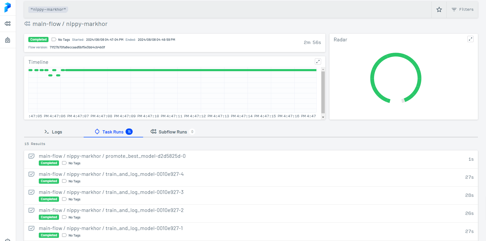
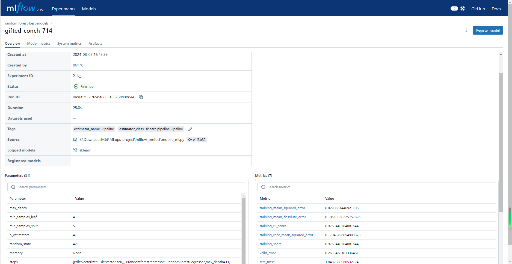
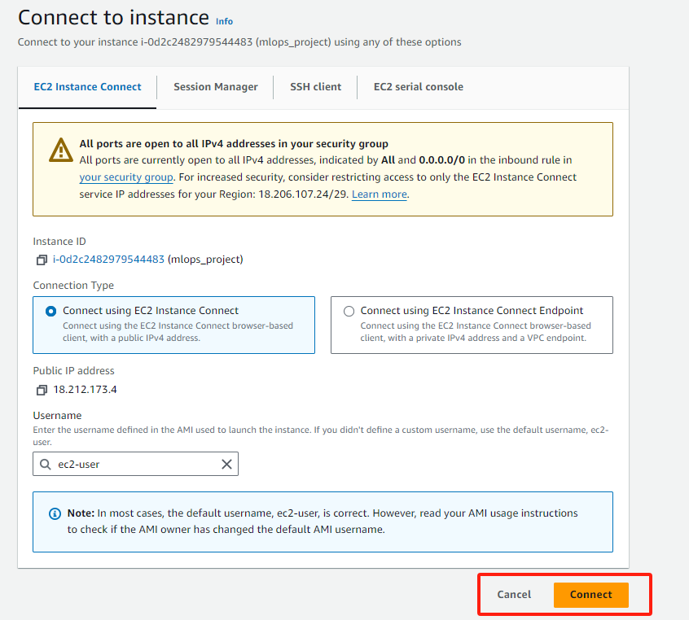
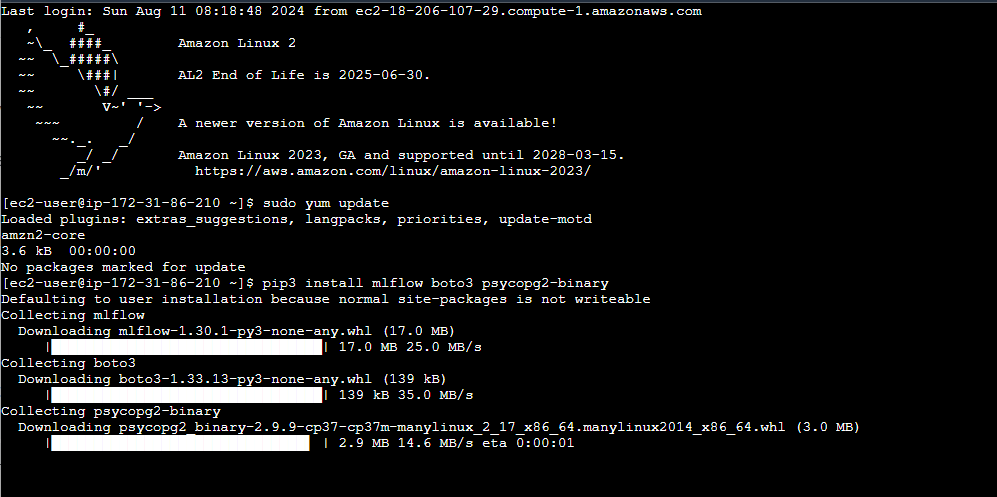
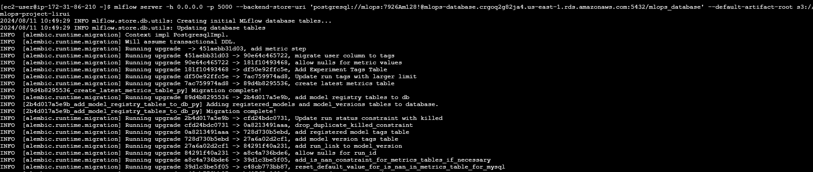
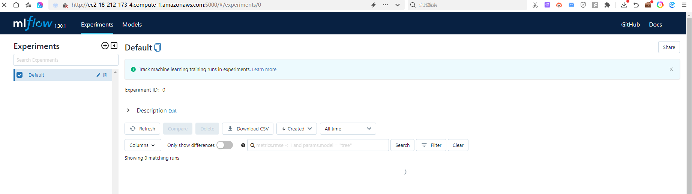
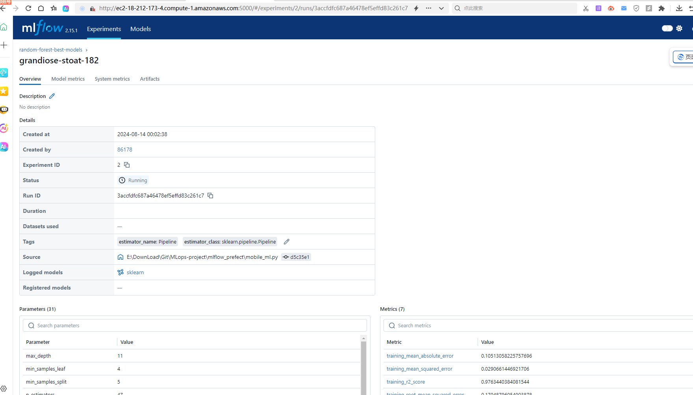

# MLops-project : Mobile Price Prediction
##  Problem Statement
The dataset I am working on is from a mobile company. It conducted a market survey to collect the prices of many mobiles, which helps to price its newly produced mobile phones. This dataset comprises 2001 entries, each detailing various features of the mobile phones, such as RAM, memory, battery power, and Front Camera mega pixels. The aim of my project is to employ machine learning to identify the relationship between these features and the phone’s price range (categorized from 0 to 3, where 0 represents the lowest price range and 3 represents the highest) and then make predictions
for new data.
One interesting aspect of this dataset that inspires me is its practical purpose. By gaining a deeper understanding of how mobile phone features influence pricing, I can make more informed decisions when purchasing a phone in the future. It can help me avoid being misled by sales personnel and ensure that I am paying a fair price for the features that matter most to me.

## Dataset
This is a dataset from Kaggle, and the link is https://www.kaggle.com/code/vikramb/mobile-price-prediction. It has two data files -- train.csv and test.csv. I have stored them in the dataset folder. I have omit the EDA process and Feature Engineering process since it is a mlops project. I finally keep six attribute:  . 

## Model
To address this multiple class classification problem, I utilize three kinds of different algorithms like the above dataset. But some algorithms are different:
Support Vector Machines (SVM): For this problem, I experiment with two different kernel functions: the modified version –SVC with the linear kernel and the radial basis function (RBF) kernel, which is very suitable to multiple class classification.
k-Nearest Neighbors (k-NN): I used the same algorithms as in the previous dataset.
Decision Tree Boosting (Extra credit): I use a boosting algorithm to enhance the performance of decision trees. Specifically, it creates a base decision tree classifier and uses the AdaBoost algorithm to boost it.

## Setting up the environment
In the windows environment, run init_config.py to initialize the configuration of these variables.  

Firstly, I will find prefect.exe and add it into the environment path. Use the following cmd to check if it exists.
```
py -3.8 -m pip show prefect
```

Then use the following command to start the prefect server and mlflow server:
```
prefect orion start
mlflow server -h 0.0.0.0 -p 5000 --backend-store-uri sqlite:///mlflow.db --default-artifact-root ./mlruns
```

## Running the project
### 1. Running it locally
Run the mobile_ml.py, then we can see the result in the prefect server and mlflow like this







We can also configure our flow deployment using the following command:
```
prefect deployment apply -n "model_training"
prefect deployment run "model_training"
```

 execute:```mobile_ml.py```

  Please remember to fill in your own TRACKING_SERVER_HOST and AWS_PROFILE in the init_config.py 

### 2. Running it in the cloud

Connect to the EC2 instance in AWS cloud. Then, in the EC2 console, select your instance and click the Connect button. 
 

After that, execute:
```
mlflow server -h 0.0.0.0 -p 5000 --backend-store-uri postgresql://DB_USER:DB_PASSWORD@DB_ENDPOINT:5432/DB_NAME --default-artifact-root s3://S3_BUCKET_NAME
```   

 
 
 

then check the server is up going to ```http://<EC2_PUBLIC_DNS>:5000```

 

 more details can be seen here: https://github.com/DataTalksClub/mlops-zoomcamp/blob/main/02-experiment-tracking/mlflow_on_aws.md 
 
 
Next, for Model deployment, cd into web-services in the local environment.

There, we can execute in a terminal python predict.py and in another one python test_sample.py. predict.py will pull the best model from aws s3 in case the variable TRACKING_SERVER_HOST set before, or from the local mlrun artifact location otherwise.

Also, there is a Dockerfile to containerize and deploy to any cloud where Docker is accepted. For that, I will firstly git clone my project to ec2 instance(the next try is ```git reset --hard; git pull origin main```), then execute in AWS EC2 terminal ```sudo service docker start```;
```sudo docker build -t mobile-price-prediction-service:v1 .``` to build the Docker image and then ```docker run -it --rm -p 9696:9696  mobile-price-prediction-service:v1``` , and in another terminal execute ```python test_web_service.py``` to verify that it is working. Note that in this case, the model is loaded from model.pkl since from inside the docker image it is difficult and also not suggested to access aws credentials, which are needed to pull the artifacts from S3. This is solved by passing the model binary (which includes the dictionary vectorizer and the model itself).

 

## Deploying Schedule
  For Workflow orchestration, you can execute prefect orion start in a terminal and in another terminal, execute mobile_ml_prefect_deploy.py, it will make a schedule to train the model every 10th of any month, at 8 am UTC+8.


## Reuse Model after Training
We have MLflow Tracking Server running locally, and you can visit http://127.0.0.1:5000 to view the experiments and run logs. best_run_id is displayed at the top of the run details page.Or during training, the best_run_id is usually printed in the console output. we can review the console output when running mobile_ml.py or mobile_ml_prefect_deploy.py to find similar logs.

After finding, execute the predict.py, and it will provide the result for test_sample.

If you have downloaded the artifacts in your local environment, you can predict as this way:
 
 ```
local_model_path = 'mlflow_artifacts/model/model.pkl'  # your local path

with open(local_model_path, 'rb') as f_in:
    model = pickle.load(f_in)

def predict(features):
    X = model.named_steps['dictvectorizer'].transform(features)
    preds = model.named_steps['randomforestregressor'].predict(X)
    return float(preds[0])
  ```